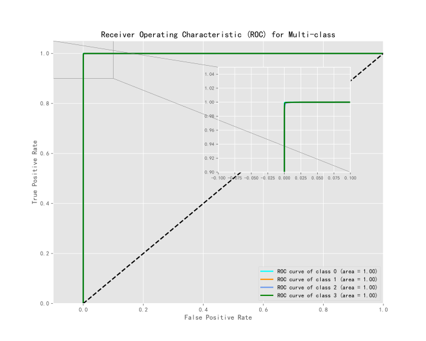

# Multi-classification prediction of XGBoost model based on SMOTE and feature selection

Result:
```c
------------------------------------------------------------
Training Metrics:
Accuracy: 0.999114
Avg. AUC: 0.998785
Avg. Precision: 0.996574
Avg. recall: 0.997930
Avg. avg_f1: 0.998173
MCC: 0.998472

class_report: {'0': {'precision': 0.9997933286487827, 'recall': 0.9995867427060088, 'f1-score': 0.9996900250046497, 'support': 24198.0}, 
'1': {'precision': 0.9994834586646806, 'recall': 0.9996755977411991, 'f1-score': 0.9995795189697013, 'support': 83230.0}, 
'2': {'precision': 0.9979722232849982, 'recall': 0.9980485938396786, 'f1-score': 0.9980104071013162, 'support': 26135.0}, 
'3': {'precision': 0.9964196762141968, 'recall': 0.9944073326083579, 'f1-score': 0.9954124873649016, 'support': 6437.0}, 
'accuracy': 0.9991142857142857, 
'macro avg': {'precision': 0.9984171717031647, 'recall': 0.9979295667238112, 'f1-score': 0.9981731096101422, 'support': 140000.0}, 
'weighted avg': {'precision': 0.999114033876063, 'recall': 0.9991142857142857, 'f1-score': 0.9991141054262251, 'support': 140000.0}}
------------------------------------------------------------
Test Metrics:
Accuracy: 0.997133 
Avg. AUC: 0.996294
Avg. Precision: 0.989559
Avg. recall: 0.993733
Avg. avg_f1: 0.994392
MCC: 0.995042

class_report: {'0': {'precision': 0.9990188383045526, 'recall': 0.9981374375061268, 'f1-score': 0.998577943411955, 'support': 10201.0}, 
'1': {'precision': 0.9984624846248462, 'recall': 0.9986020633544888, 'f1-score': 0.9985322691119528, 'support': 35767.0}, 
'2': {'precision': 0.9930144132991423, 'recall': 0.994949942411624, 'f1-score': 0.9939812356169233, 'support': 11287.0}, 
'3': {'precision': 0.9897323065639897, 'recall': 0.9832422586520947, 'f1-score': 0.9864766081871346, 'support': 2745.0}, 
'accuracy': 0.9971333333333333, 
'macro avg': {'precision': 0.9950570106981328, 'recall': 0.9937329254810835, 'f1-score': 0.9943920140819914, 'support': 60000.0}, 
'weighted avg': {'precision': 0.9971327953591196, 'recall': 0.9971333333333333, 'f1-score': 0.997132362765908, 'support': 60000.0}}
------------------------------------------------------------
```


